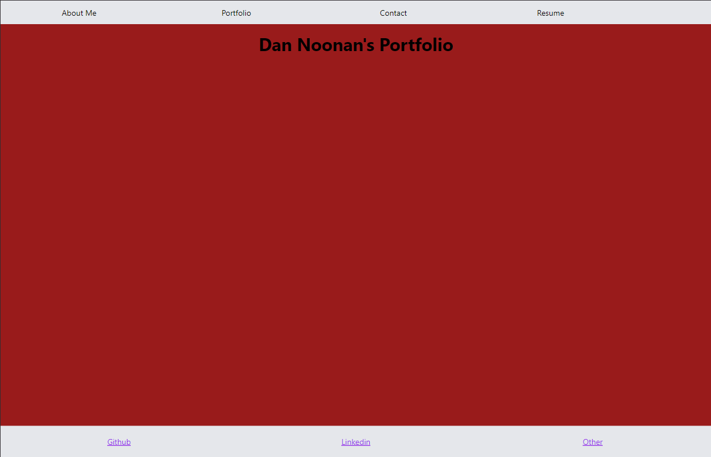

# React Portfolio

## Description

This project was to create a portfolio using react. 

## Installation

Deployed Website:

To run the program either launch the deployed website or, if using the code, open the main directory in the terminal and type `npm install`.

## Usage

After all the proper files are installed on your computer, open the folder in a terminal.  Then type `npm run dev`.  It will be running on `http://localhost:5173/`.  Open the website by either going to the deployed site or `http://localhost:5173/` if running the code.  On the site there are 4 tabs on the top of the page to navigate the site.  "About Me" has information about myself.  "Portfolio" has a list of my projects with links to their Github page and the deployed site, if available.  "Contact" has a link that can be clicked that opens your e-mail and auto populates my e-mail address.  There is also a form on the bottom of the page that can be filled out but doesn't actually have messaging functionality.  "Resume" has a link that opens a pdf of my resume.  On the bottom of all the pages are links to my Github, Linkedin, and Twitter.

## Credits

Some code modified from code taken from: 
https://git.bootcampcontent.com/

## Features

This program features react and tailwind